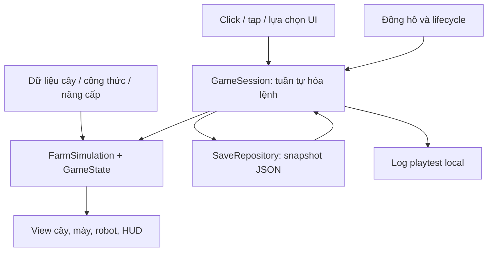

# Kế hoạch MVP — Vườn Nhỏ: Quán Trà

Phiên bản 0.2 — SOLO END-TO-END · Cập nhật 06/09/2026 · Tài liệu concept, kỹ thuật và playtest.

**Ràng buộc do người làm game xác nhận:** chỉ một người phụ trách design, code, model, animation, UI, âm thanh, kiểm thử và phát build; có 25–30 giờ/tuần; chưa dùng hoặc mới bắt đầu Blender. Đây là cơ sở cho mọi quyết định phạm vi và thời gian trong bản này. Kinh nghiệm Unity/C# chưa được xác nhận. Không giả định có artist, người làm audio hoặc QA làm song song.

Tài liệu đi kèm: [Hướng dẫn tự tạo asset và tích hợp Unity](C:/Users/PC/Documents/Codex/2026-09-05/baay/outputs/Huong-dan-Asset-Technical-Solo.md). Tài liệu đó quy định model cần tạo, cách dựng từng nhóm, export/import, prefab, icon, âm thanh và điều kiện nghiệm thu.

Thay đổi so với v0.1: chia hai mốc A/B; thay robot đi bộ bằng robot nổi dùng transform; gộp quán và máy thành một cụm; dùng 11 thiết kế model gốc, 7 icon và 9 material; nhạc nền trở thành tùy chọn; thay lịch 6 tuần có người hỗ trợ bằng ngân sách giờ solo; dự kiến dùng Unity 6000.6.0f1 đã có trên máy sau smoke test.

Đây là kế hoạch triển khai, chưa phải game đã được xây dựng. Tên game, số cân bằng và thời lượng dưới đây là đề xuất để bắt đầu thử nghiệm. Các mốc economy đã được kiểm tra bằng mô phỏng số đơn giản; cảm giác chơi và hiệu năng chưa được kiểm chứng trên bản Unity.

## 1. Định hướng và giả định

**Mục tiêu:** làm một khu vườn nhỏ có vòng chơi hoàn chỉnh, cho người mới trải nghiệm từ tự chăm cây đến sản xuất tự động trong phiên đầu. Bản MVP phải giúp quyết định có nên đầu tư tiếp vào game này hay không.

| Quyết định tạm thời | Phương án triển khai | Lý do |
|---|---|---|
| Nền tảng test | Windows x64, chơi bằng chuột, màn hình ngang | Phát bản build nội bộ và quan sát nhanh |
| Hướng mở rộng | Android màn hình ngang sau đợt test đầu | Tách input và giao diện từ đầu; cần QA riêng trên thiết bị thật |
| Đồ họa | 3D stylized, camera orthographic cố định | Tạo cảm giác 2.5D gần ảnh tham khảo |
| Quy mô | Mốc A: 4 ô/1 cây; mốc B: tối đa 12 ô/3 cây | Kiểm chứng vòng chơi trước khi sản xuất toàn bộ asset |
| Phiên chơi | Khoảng 20–30 phút khám phá nội dung nếu chơi liên tục | Giả thuyết cần đo, không phải thời lượng bảo đảm |
| Chế độ chơi | Một người, hoạt động hoàn toàn offline | Không cần tài khoản hoặc server cho bài test này |
| Nhân lực | Một người, 25–30 giờ/tuần, mới Blender | Giờ học, art, code, điều phối test và sửa lỗi đều dùng chung quỹ thời gian |
| Chi phí nội dung | Baseline tự tạo custom asset, không phụ thuộc mua pack hoặc thuê ngoài | Công cụ, font và thư viện thông dụng vẫn có thể tái sử dụng; theo dõi nguồn |
| Ngôn ngữ | Tiếng Việt trong MVP, text tách khỏi logic | Dễ thử với nhóm người chơi đầu tiên |

Ảnh tham khảo được dùng để định hướng màu sắc, góc nhìn và cảm giác khu vườn. Kế hoạch không giả định đã có sẵn model, animation hoặc mã nguồn của game trong ảnh.

Ba giả thuyết cần kiểm tra:

1. Trồng, nhìn cây lớn, thu hoạch và thấy tiền tăng có tạo cảm giác dễ chịu không?
2. Việc mở robot có làm người chơi thấy mình tiến bộ và muốn nâng cấp tiếp không?
3. Sau khi quay lại, người chơi có hiểu khu vườn đã làm gì và biết việc tiếp theo cần làm không?

MVP này chưa đủ nội dung để kết luận về retention dài hạn, khả năng kiếm tiền hoặc chiều sâu chiến thuật.

## 2. Concept và trải nghiệm người chơi

Người chơi khôi phục một quán trà giữa khu vườn nhỏ. Ban đầu họ trồng bạc hà, thu nguyên liệu và cho máy pha trà. Tiền bán trà dùng để kích hoạt robot làm vườn, mở thêm đất, thêm cây và cải thiện năng suất.

**Cảm xúc chủ đạo:** ấm áp, thư giãn, nhìn thấy thành quả. Không có cây chết, năng lượng cạn, mùa vụ thất bại hoặc phạt vì bỏ game lâu.

**Vai trò người chơi:** quản lý khu vườn bằng click/chạm. Một robot nổi nhỏ cạnh vườn là điểm nhấn thị giác; thân, mặt và anten là các khối cứng. Chuyển động nhấp nhô/nghiêng bằng code, không cần bộ xương, skinning hoặc animation đi bộ.

Vòng chơi chính:

**Chọn cây → gieo → cây lớn → thu nguyên liệu → máy pha → tự bán trà → mua mở khóa/nâng cấp.**

Sau khi có robot, gieo và thu diễn ra tự động. Người chơi chuyển sang chọn cây, công thức và thứ tự nâng cấp. Vườn tiếp tục vận hành khi đóng game theo các quy tắc offline ở mục 9.

Đặc điểm riêng trong phạm vi MVP: khu vườn giống một mô hình nhỏ sống động; mỗi tiến bộ làm cảnh thay đổi rõ ràng — robot thức dậy, thêm luống cây, máy chạy nhanh hơn, cây mới có màu sắc mới.

## 3. Phạm vi nội dung

### Hai mốc để một người có thể hoàn thành

**Mốc A — bản kiểm tra vòng chơi:** 4 ô, một cây bạc hà, một công thức, một máy, một lần mua robot 200 xu, HUD ngắn, save/offline đúng và công cụ reset/tua thời gian cho dev. Dùng primitive Unity. Chưa có chọn công thức, bán thô, mở đất hoặc cửa hàng nhiều nâng cấp. Test với 3 người quen; chỉ mở rộng khi họ hiểu vòng chơi và tự động hóa, không có lỗi chặn/save.

**Mốc B — MVP có hình ảnh nhất quán:** thêm phần nội dung ở bảng dưới, tự tạo bộ asset nhỏ, hoàn thiện giao diện và test ngoài. Bảng economy và route 30 phút ở mục 5 áp dụng cho mốc B; không dùng để nghiệm thu nội dung mốc A.

Không tách riêng một giai đoạn học Blender dài trước khi có gameplay. Hoàn thành mốc A bằng primitive, sau đó học và làm một góc vườn mẫu, import thành công rồi mới sản xuất cả bộ.

### Bắt buộc có trong mốc B

| Hạng mục | Phạm vi chính xác | Điều kiện hoàn thành |
|---|---|---|
| Bản đồ | 12 ô cố định, ban đầu mở 4 ô; mở tiếp 4 và 4 | Ô khóa không nhận lệnh trồng; mở đất đúng một lần |
| Cây trồng | Bạc hà, cúc, dâu; mỗi cây có 3 trạng thái hình ảnh phát triển | Nhìn rõ đang lớn và đã chín; cây chín không chết |
| Trồng/thu | Gieo miễn phí; một click trên cây chín thu và gieo lại | Không cần thao tác mua hạt hoặc tưới |
| Máy pha | Một máy, 3 công thức, chỉ chọn một công thức đang hoạt động | Có đủ nguyên liệu thì tự pha; thiếu thì chờ |
| Bán hàng | Trà hoàn thành tự chuyển thành xu; bán nguyên liệu thô bằng tay | Tiền và kho cập nhật đúng, không bán lại đầu ra đã tự bán |
| Robot | Một lần mở khóa, tự thu và gieo lại các ô đã được chọn cây | Làm được việc khi người chơi không tương tác hoặc đã thoát game |
| Nâng cấp | 3 nhóm: diện tích, tốc độ cây, tốc độ máy | Giá, điều kiện và hiệu quả được hiển thị trước khi mua |
| Kho | 3 loại nguyên liệu, không giới hạn sức chứa trong MVP | Không có tình huống kho đầy làm dừng toàn bộ vườn |
| Hướng dẫn | Một chuỗi mục tiêu ngắn, theo hành động thực tế | Có thể tiếp tục đúng bước sau khi load save |
| Lưu game | Save local có phiên bản, backup và khôi phục | Giữ tiền, cây, máy, nâng cấp và hướng dẫn |
| Offline | Tối đa 4 giờ tiến độ cho một lần vắng mặt | Tính theo trạng thái thật; không cộng lại khi mở popup nhiều lần |
| Công cụ test | Reset có xác nhận, tua thời gian trong dev build, xuất log | Các công cụ gian lận thời gian không xuất hiện trong bản playtest thường |
| Hoàn thiện cảm giác | Phản hồi click, thu hoạch, xu, mở khóa, âm thanh cơ bản | Người chơi thấy ngay kết quả hành động |

### Có thể thêm sau khi bản đầu đã qua test

Zoom nhẹ, thêm chuyển động robot, nhạc nền tự làm, thêm đồ trang trí cố định, âm thanh môi trường và bản Android thử nghiệm. Không cộng ngầm những phần này vào ngân sách MVP.

### Ngoài phạm vi MVP

Multiplayer, đăng nhập, cloud save, quảng cáo, IAP, sự kiện, battle pass, prestige/reset kiếm lợi, thời tiết, ngày đêm ảnh hưởng gameplay, hệ thống nhiệm vụ tổng quát, nhiều máy, nhiều bản đồ, đặt công trình tự do, pet và điều khiển/pathfinding nhân vật.

Các nhóm tính năng này có thể trở thành bước tiếp theo khi dữ liệu test cho thấy vòng chơi hiện tại đáng phát triển.

## 4. Luật gameplay cần chốt trước khi code

### Ô đất và cây

- Ô đất có trạng thái Locked, Empty, Growing hoặc Ready.
- Ban đầu mở 4 ô trống, 0 xu; bạc hà và công thức trà bạc hà được mở sẵn. Máy đã có sẵn.
- Chọn cây trên ô trống sẽ gieo ngay, miễn phí. Hướng dẫn mời người chơi gieo cả 4 ô.
- Khi chưa có robot: cây chín chờ vô thời hạn. Click ô chín sẽ thu 1 nguyên liệu và gieo lại cây được chọn cho vòng tiếp theo trong cùng một hành động.
- Sau khi có robot: cây chín được thu và gieo lại ngay bằng logic. Robot chỉ thể hiện một số thao tác trên màn hình; tốc độ đi của robot không ảnh hưởng năng suất.
- Ô mới mở vẫn trống cho đến khi người chơi chọn cây lần đầu. Robot không tự chọn loại cây cho người chơi.
- Đổi loại cây khi đang có cây sẽ đặt lựa chọn cho lần gieo tiếp theo; cây hiện tại tiếp tục lớn. UI ghi rõ “Vụ tiếp theo: …”. Không hủy cây hoặc hoàn tiền.
- Animation gieo và thu không khóa input, không quyết định thời điểm cộng vật phẩm.

### Máy và bán hàng

- Máy khởi đầu bật sẵn với công thức bạc hà. Có đủ 2 nguyên liệu phù hợp thì tự bắt đầu một mẻ.
- Trừ toàn bộ nguyên liệu đúng lúc bắt đầu mẻ. Số nguyên liệu đó không còn trong kho để bán tay.
- Mẻ hoàn thành cộng xu ngay, không tạo thêm một kho trà hay yêu cầu bấm nhận tiền.
- Máy thử bắt đầu mẻ tiếp theo sau khi hoàn thành hoặc sau khi kho thay đổi.
- Chọn công thức mới khi đang pha: mẻ hiện tại hoàn thành trước; công thức mới áp dụng từ mẻ tiếp theo. Khi máy đang chờ, đổi công thức có hiệu lực ngay.
- Thiếu nguyên liệu: hiển thị tên và số còn thiếu. Máy không tự đổi công thức.
- Người chơi có thể bán 1 hoặc toàn bộ số nguyên liệu của một loại đang có trong kho. Nguyên liệu đang dùng cho công thức được đánh dấu rõ. Bán hết có thể khiến mẻ sau phải chờ cây, nhưng không hủy mẻ hiện tại.
- Không có phí vận hành, hạt giống hoặc bảo trì. Người chơi luôn có thể gieo bạc hà và khôi phục sản xuất.

### Mở khóa và nâng cấp

- Trước khi mua robot, cửa hàng chỉ cho mua robot. Điều này bảo vệ nhịp mở tự động hóa trong phiên đầu.
- Sau robot, mở lựa chọn cây/công thức và các nâng cấp. Dâu yêu cầu đã mở cúc; mở 12 ô yêu cầu đã mở 8 ô.
- Khi mua cây mới, hiển thị hướng dẫn chọn cây cho ô đất và chọn công thức tương ứng. Không âm thầm thay toàn bộ khu vườn.
- Tốc độ cây và tốc độ máy chỉ áp dụng cho chu kỳ bắt đầu sau khi nâng cấp. Timer đang chạy giữ nguyên.
- Hướng dẫn gợi ý một lộ trình, không tự mua hoặc bắt buộc mua theo lộ trình đó sau robot.
- Không thêm tiền thưởng nhiệm vụ trong balance v0; nếu thêm thưởng ở bản sau phải tính lại nhịp mua nâng cấp.

## 5. Economy v0 và nhịp 30 phút

Tất cả số trong mục này là **giá trị khởi điểm để test**, không phải thiết kế đã được chứng minh là vui.

### Cây và công thức

| Cây | Thời gian lớn | Thu mỗi vụ mỗi ô | Bán thô / đơn vị | Công thức | Thời gian pha cơ bản | Xu / mẻ |
|---|---:|---:|---:|---|---:|---:|
| Bạc hà | 30 giây | 1 | 2 | 2 bạc hà → trà bạc hà | 15 giây | 10 |
| Cúc | 60 giây | 1 | 5 | 2 cúc → trà hoa cúc | 20 giây | 24 |
| Dâu | 90 giây | 1 | 8 | 2 dâu → trà dâu | 30 giây | 40 |

### Giá mở khóa và nâng cấp

| Hạng mục | Giá xu | Hiệu quả |
|---|---:|---|
| Kích hoạt robot | 200 | Tự thu và gieo các ô đã được cấu hình |
| Mở cúc + công thức | 80 | Cho chọn cây cúc và trà cúc |
| Mở dâu + công thức | 300 | Cho chọn cây dâu và trà dâu |
| Mở vườn lần 1 | 180 | 4 → 8 ô |
| Mở vườn lần 2 | 600 | 8 → 12 ô |
| Tốc độ cây, một lần | 240 | Thời gian lớn × 0,8: 24 / 48 / 72 giây |
| Tốc độ máy, một lần | 240 | Thời gian pha × 0,5: 7,5 / 10 / 15 giây |
| **Tổng chi phí mở hết** | **1.840** | Không bao gồm nội dung sau MVP |

Thu nhập tự động ổn định của một vườn trồng cùng loại cây:

**Xu/phút = min(số ô × 60 ÷ giây lớn ÷ 2, 60 ÷ giây pha) × xu mỗi mẻ.**

Công thức này dùng để kiểm tra balance ở trạng thái ổn định. Mô phỏng runtime phải xử lý từng sự kiện để tính đúng khởi động, mẻ dở và thiếu nguyên liệu.

| Cây | 4 ô cơ bản | 8 ô cơ bản | 8 ô, máy nhanh | 8 ô, cả hai tốc độ | 12 ô, cả hai tốc độ |
|---|---:|---:|---:|---:|---:|
| Bạc hà | 40 | 40 | 80 | 80 | 80 |
| Cúc | 48 | 72 | 96 | 120 | 144 |
| Dâu | 53,33 | 80 | 106,67 | 133,33 | 160 |

Đơn vị: xu/phút từ trà tự bán. Chưa tính bán nguyên liệu thừa bằng tay. Với 12 ô dâu nâng tối đa, vườn tạo 10 dâu/phút, máy dùng 8; phần dư 2 dâu/phút có giá 16 xu nếu người chơi chủ động bán.

**Một điểm cần thể hiện rõ trên UI:** 4 ô bạc hà đã đủ cấp nguyên liệu cho máy cơ bản. Mở đất lúc này làm kho tăng nhưng không tăng tiền trà. Panel nâng cấp cần nhắc khi máy đang giới hạn công suất; không gắn lời hứa tăng thu nhập cho mọi lần mở đất. Bản test phải đo xem người chơi có hiểu điều này không.

### Lộ trình đã kiểm tra bằng mô phỏng số

Giả định: 4 ô bạc hà được gieo cùng lúc ở giây 0; thu thủ công ngay khi chín trước khi có robot; mua theo thứ tự dưới đây ngay khi đủ tiền; chuyển lựa chọn tất cả ô và công thức sang cây mới; cây/mẻ đang chạy hoàn thành trước; không bán thô, không thưởng nhiệm vụ, không nghỉ game. Tại mỗi thời điểm, sự kiện sản xuất được giải quyết trước lệnh mua.

| Mốc lý tưởng | Hành động | Điều người chơi nhìn thấy |
|---|---|---|
| 00:30 | Vụ bạc hà đầu tiên chín | Có thể thu cây, máy bắt đầu có nguyên liệu |
| 00:45 | Mẻ trà đầu tiên hoàn thành | Nhận 10 xu đầu tiên |
| 05:30 | Mua robot | Các vòng thu/gieo tiếp theo tự chạy |
| 07:30 | Mở cúc | Thêm lựa chọn cây và trà mới |
| 12:40 | Mở 8 ô | Khu vườn lớn rõ rệt |
| 16:20 | Tăng tốc máy | Máy tiêu thụ kho nhanh hơn |
| 18:30 | Mở dâu | Thêm màu sắc và giá trị mẻ cao hơn |
| 22:10 | Tăng tốc cây | Chu kỳ trồng mới ngắn hơn |
| 27:01 | Mở 12 ô | Hoàn thành toàn bộ mở khóa MVP |
| 30:00 | Tiếp tục vận hành | Khoảng 450 xu còn lại theo route này |

Đây là kết quả của một người chơi lý tưởng trong mô phỏng, không phải quan sát người thật và không khẳng định route tối ưu. Người chơi đọc hướng dẫn, chậm thu hoặc mua khác thứ tự sẽ có mốc khác. Mục tiêu thực tế ban đầu: trà đầu trong 2 phút, robot trong 5–8 phút; điều chỉnh sau test.

Khoảng 40–44 lần thu thủ công có thể diễn ra trước robot nếu chăm đủ 4 ô bạc hà. Nếu thao tác này gây mệt, ưu tiên giảm giá robot hoặc thử nút thu tất cả trong vòng lặp tiếp theo, rồi đo lại.

Một lần nghỉ 4 giờ sau khi có robot có thể tạo khoảng 9.600 xu với bạc hà ổn định, hoặc 38.400 xu ở vườn dâu tối đa; con số thật phụ thuộc trạng thái đầu và mẻ dở. Vì tổng mở khóa chỉ 1.840 xu, một lần nghỉ dài có thể mua hết nội dung. Cap 4 giờ phục vụ kiểm thử hệ thống; bản này không có đủ progression cho bài test giữ chân nhiều ngày.

## 6. Hình ảnh, bản đồ và giao diện

### Bố cục khu vườn

Camera nhìn chéo xuống một khu vườn nhỏ. Cụm luống 3 × 4 ở giữa, máy và quán trà phía trên, robot đứng gần luống. Cây và hàng rào nằm ở mép để không che mục tiêu click. Các ô chưa mở nằm liền cụm đã mở, giúp người chơi nhìn ra hướng phát triển.

Điểm bắt đầu để dựng camera: orthographic, xoay ngang khoảng 45°, nghiêng xuống khoảng 35°. Đây là thông số bố cục thử nghiệm, không phải số đo từ ảnh. Chỉnh framing để thấy đủ vườn và HUD ở 1366 × 768; kiểm tra thêm 1920 × 1080 và màn hình ngang rộng.

Màu chủ đạo: xanh cỏ dịu, kem đất, nâu gỗ; điểm nhấn vàng cho xu, hồng/đỏ cho dâu. Dùng khối bo mềm, cây có silhouette dễ phân biệt, một nguồn sáng chính và bóng mềm vừa đủ. Cây chín phải có hình dáng/dấu hiệu riêng, không chỉ đổi màu. Không dùng depth of field làm mờ luống cần thao tác.

### Asset tối thiểu tự sản xuất

| Nhóm | Thiết kế model gốc cần làm | Cách tái sử dụng |
|---|---:|---|
| Ô đất | 1 | Đặt 12 instance; trạng thái bằng viền/badge |
| Mầm cây chung | 1 | Dùng cho cả 3 loại cây |
| Cây trưởng thành | 3 | Bạc hà/cúc/dâu dùng chung cách làm thân/lá; cây giữa vụ lấy phần lá của model trưởng thành |
| Robot nổi | 1 | Các phần cứng, 0 rig, 0 clip Blender; chuyển động transform |
| Quầy có máy pha tích hợp | 1 | Một cụm cố định; tốc độ/đèn/hiệu ứng biểu diễn nâng cấp |
| Props | 4 | Cây nền, bụi, hàng rào, đá; xoay và scale có giới hạn |
| **Tổng model gốc** | **11** | Số mesh/bộ phận con có thể lớn hơn; 12 ô không phải 12 model phải vẽ |

Nền đất lớn dùng primitive Unity, không tính là một thiết kế model riêng. Chín trạng thái cây trên màn hình được tạo từ một mầm chung và ba model cây trưởng thành; không làm chín bộ model riêng.

Đồ họa dùng 9 material màu phẳng chung, 7 PNG icon render từ model có sẵn, UI bằng hình cơ bản, 4 mẫu motion/VFX và 5 cue âm thanh tự ghi/tổng hợp. Công thức dùng lại icon cây kèm chữ; tiền hiển thị bằng chữ “Xu”, không cần bộ icon trà và model đồng tiền riêng. Nhạc nền không nằm trong gate MVP.

Tạo một ô bạc hà có hình ảnh hoàn chỉnh trước khi làm cúc, dâu và props. Cổng nghiệm thu là nhìn rõ ở camera game 1366 × 768, thay model không làm hỏng gameplay và export/reimport giữ đúng kích thước. Chi tiết thao tác, ngân sách từng nhóm và checklist nằm trong [hướng dẫn asset](C:/Users/PC/Documents/Codex/2026-09-05/baay/outputs/Huong-dan-Asset-Technical-Solo.md).

### Các bề mặt UI

| Bề mặt | Nội dung và tương tác |
|---|---|
| HUD | Xu hiện có, mục tiêu hiện tại, nút kho/nâng cấp/cài đặt |
| Ô đất / chọn cây | Cây hiện tại, tiến độ, trạng thái chín, cây vòng tiếp theo, cây chưa mở |
| Máy pha | Công thức đang chọn, mẻ hiện tại, tiến độ, thiếu nguyên liệu hoặc đang chạy |
| Kho | Số lượng 3 nguyên liệu, giá, bán 1/bán hết; đánh dấu nguyên liệu máy đang dùng |
| Nâng cấp | Giá, điều kiện, hiệu quả, trạng thái đã mua; gợi ý khi máy là giới hạn công suất |
| Báo cáo quay lại | Thời gian được tính, xu đã kiếm, nguyên liệu thay đổi, lời nhắc máy thiếu nguyên liệu nếu có |
| Cài đặt / test | Âm lượng, thoát, xuất log test; reset cần xác nhận rõ |

HUD không che luống ở viewport nhỏ. Click lên UI không truyền xuống đất. Nút có trạng thái disabled kèm lý do. Popup quay lại dùng “Tiếp tục”; tiền đã được áp dụng và lưu trước khi popup hiện.

Chuỗi hướng dẫn tối thiểu: gieo → thu → thấy trà tạo tiền → mua robot → chọn cây/công thức mới. Mục tiêu sau đó hướng người chơi đến mở đất hoặc cải thiện máy. Dùng một chỉ dẫn ngắn tại một thời điểm, không làm chuỗi hội thoại dài.

## 7. Stack kỹ thuật

Máy đã có **Unity 6000.6.0f1**. Bản v0.2 dự kiến dùng chính bản này cho prototype để giảm công thiết lập; trước khi khóa phải mở scene URP, import model chuẩn và build Windows thành công. Đây là bản phát hành chính thức, không gọi là LTS. Nếu gặp lỗi chặn trong spike mới đánh giá chuyển phiên bản; không tự đổi engine giữa các mốc. [Release notes Unity 6000.6.0f1](https://unity.com/releases/editor/whats-new/6000.6.0f1).

| Thành phần | Lựa chọn | Vai trò |
|---|---|---|
| Game engine | Unity 6000.6.0f1, C#, sau smoke test | Scene, build, input, UI và hiển thị |
| Rendering | Universal Render Pipeline, 3D Renderer | Cảnh 3D stylized và đường nâng cấp sang mobile |
| Camera | Camera orthographic thông thường | Một góc nhìn cố định; chưa cần Cinemachine |
| Input | Unity Input System | Map click/tap vào cùng lệnh gameplay |
| UI | Unity UI/uGUI + TextMeshPro | HUD, popup, icon và text |
| Nội dung tĩnh | ScriptableObject, chuyển thành config chỉ đọc lúc khởi động | Cây, công thức, nâng cấp, thông số balance |
| Logic | C# thuần, không phụ thuộc scene | Mô phỏng, tiền, kho, lệnh và kiểm thử |
| Save | DTO có phiên bản, JSON, file chính và backup | Lưu trạng thái runtime |
| Kiểm thử | Unity Test Framework: EditMode + PlayMode | Mô phỏng, save, nối UI và vòng đời ứng dụng |
| Quản lý nguồn | Git; Git LFS cho asset nhị phân lớn khi cần | Theo dõi mã và nội dung |
| Đồ họa | Primitive Unity ở A; Blender cho bộ model ở B | Tự dựng model đơn giản; chuyển động làm ở Unity |
| Audio | Ghi vật dụng hoặc tổng hợp sóng đơn giản, chỉnh bằng công cụ audio | 5 cue ngắn, không phụ thuộc mua thư viện |

URP được Unity thiết kế cho nhiều nền tảng, gồm mobile và PC. Hiệu năng thực tế vẫn phải đo trên build. [Tài liệu URP](https://docs.unity3d.com/6000.3/Documentation/Manual/urp/urp-introduction.html).

Chọn bản Input System tương thích mà Package Manager đề xuất, commit manifest và package lock; không tự động nâng package giữa đợt test. [Hướng dẫn cài Input System](https://docs.unity3d.com/Packages/com.unity.inputsystem@1.17/manual/Installation.html).

ScriptableObject dùng cho dữ liệu thiết kế; tiến trình người chơi được lưu riêng. Trong standalone player, thay đổi asset ScriptableObject không phải cơ chế tự lưu tiến trình bền vững. [Tài liệu ScriptableObject](https://docs.unity3d.com/6000.3/Documentation/Manual/class-ScriptableObject.html).

Save đặt dưới Application.persistentDataPath; giữ ổn định định danh sản phẩm giữa các build test để tìm lại dữ liệu. [Tài liệu persistentDataPath](https://docs.unity3d.com/6000.3/Documentation/ScriptReference/Application-persistentDataPath.html).

MVP không cần backend. Firebase/PlayFab chỉ trở thành quyết định triển khai khi bổ sung cloud save hoặc dịch vụ online có mục tiêu rõ.

## 8. Kiến trúc và dữ liệu

### Tách mô phỏng khỏi hiển thị

GameState là nguồn sự thật duy nhất cho tiền, kho, timer và mở khóa. View có thể mất hoặc dựng lại mà tiến trình không đổi. Không dùng coroutine/animation của từng cây làm nguồn timer kinh tế.

| Module | Trách nhiệm | Không sở hữu |
|---|---|---|
| GameSession | Nạp game, đưa simulation đến hiện tại, xử lý command, gọi lưu và cập nhật view | Quy tắc giá hoặc animation |
| FarmSimulation | AdvanceTo theo thời gian, giải quyết cây/máy/automation | GameObject, input, đường dẫn file |
| GameState | Tiền, kho, ô, batch, nâng cấp, thời gian simulation | Tham chiếu prefab/Transform |
| Command handlers | Plant, HarvestAndReplant, SetNextCrop, SelectRecipe, SellRaw, Purchase | Đọc trực tiếp text trên UI để quyết định giá |
| ContentCatalog | Stable ID và cấu hình chỉ đọc | Tiến trình riêng của người chơi |
| SaveRepository | Ghi snapshot, validate, backup, load và migration cụ thể | Cộng thưởng offline |
| LifecycleCoordinator | Running/Suspended/Resuming; chống xử lý resume lặp | Quy tắc thu nhập |
| FarmView / HUD | Dựng hình từ state; gửi ý định người dùng | Tự cộng tiền hoặc vật phẩm |
| TestLogger | Ghi sự kiện có build/balance/session ID | Gửi dữ liệu ra ngoài tự động |

Đây là bảng trách nhiệm, không phải yêu cầu tạo mười framework hoặc mười manager. Mốc A chỉ cần bốn phần triển khai: GameState/FarmSimulation; GameSession nhận command và lifecycle; SaveRepository; các view Unity. Command handler là method; lifecycle có thể là state machine nhỏ trong GameSession. Một scene gameplay và các thư mục Core, Views, Infrastructure, Content, Tests là đủ. Không thêm event bus tổng quát, DI, ECS hoặc class riêng cho từng nút.

GameObject có wrapper giữ script, ID và collider; model nằm trong VisualRoot bên dưới. Thay primitive bằng FBX chỉ thay VisualRoot. Root của ô giữ scale 1 và collider cố định, không lớn/nhỏ theo cây. Robot không có NavMesh hay nhiệm vụ đi tới từng ô. Quy định kích thước, pivot, hướng và các visual state nằm trong tài liệu asset.

### Nội dung tĩnh

| Cấu hình | Trường tối thiểu |
|---|---|
| CropDefinition | id, tên, baseGrowthMs, yield, rawSellPrice, unlockId, matureVisual; mầm chung và cấu hình giai đoạn hiển thị |
| RecipeDefinition | id, inputCropId, inputCount, baseBrewMs, outputCoins |
| UpgradeDefinition | id, giá cố định, điều kiện, loại hiệu ứng, giá trị hiệu ứng |
| BalanceConfig | version, initialPlots=4, maximumPlots=12, offlineCapMs=14.400.000 |

Runtime lấy dữ liệu logic đã tách khỏi asset Unity. Validator từ chối ID trùng/không tồn tại, thời gian không dương, giá âm và yield không dương. Mọi chu kỳ có thời lượng dương để tránh vòng lặp sự kiện vô hạn.

### Save snapshot

| Nhóm | Trường cần lưu |
|---|---|
| Metadata | schemaVersion, balanceVersion, saveRevision, buildId |
| Đồng hồ | simulationTimeMs, checkpointUtcMs |
| Kinh tế | coins dạng số nguyên 64-bit, inventory theo cropId |
| Ô đất | plotId, unlocked, state, currentCropId, nextCropId, startAtMs, finishAtMs, yield của vụ đang chạy |
| Máy | selectedRecipeId; batch hiện tại gồm recipeId, startAtMs, finishAtMs, outputCoins đã chốt khi bắt đầu |
| Tiến độ | robotUnlocked, unlockedCropIds, cấp 3 nhóm nâng cấp, tutorialStep |
| Quay lại | pendingOfflineSummary: ID, thời gian được tính, tiền/đồ thay đổi, trạng thái đã xem |

DTO lưu JSON dùng danh sách entry cho inventory nếu serializer không hỗ trợ dictionary. Không serialize trực tiếp MonoBehaviour hoặc tham chiếu scene. Dùng stable ID thay cho tên hiển thị hoặc vị trí trong mảng.

Tiền, số vật phẩm và thời gian dùng số nguyên; thời gian là millisecond để biểu diễn chính xác cả mẻ 7,5 giây. Cấp nâng cấp lưu rời, không suy ra từ hình ảnh máy.

## 9. Simulation, offline và save

### Một thuật toán cho cả online và offline

FarmSimulation.AdvanceTo(targetSimulationTimeMs) luôn tiến thời gian về phía trước. Online chỉ gọi khi lifecycle ở Running, theo nhịp khoảng 0,25 giây, còn view nội suy thanh tiến độ mỗi frame. Độ trễ tick không làm trôi chu kỳ vì sự kiện dùng deadline chính xác.

Với 12 ô và một máy, mỗi vòng quét deadline gần nhất của các timer đang chạy là đủ. Không cần giả lập từng frame hoặc dựng nhân vật cho quãng nghỉ offline.

Tại một timestamp, xử lý theo thứ tự cố định:

1. Đưa các cây đến hạn sang Ready và hoàn thành batch máy đến hạn; cộng xu của batch đó một lần.
2. Nếu robot đã mở, thu các ô Ready theo plotId rồi gieo cây đã chọn cho vòng tiếp theo.
3. Nếu máy rảnh và đủ nguyên liệu, trừ nguyên liệu và bắt đầu mẻ mới bằng công thức đang chọn.
4. Tìm sự kiện kế tiếp, lặp cho đến target; giữ nguyên phần chu kỳ chưa hoàn tất.

Trước một command người chơi, GameSession đưa simulation đến thời điểm hiện tại, giải quyết các sự kiện đến hạn rồi mới validate và thực hiện lệnh. Sau thay đổi kho/công thức/robot, kiểm tra lại những hành động tự động có thể bắt đầu ngay. Với cây chưa có robot, thao tác thu thủ công chạy cùng quy tắc thu/gieo như automation.

Hai cách chạy cùng snapshot — chia nhiều tick online hoặc AdvanceTo một lần — phải cho kết quả giống nhau nếu có cùng lịch command. Không so hai người chơi có cách trồng/mua khác nhau rồi kết luận offline sai.

### Quy tắc offline

**elapsedMs = clamp(nowUtcMs − checkpointUtcMs, 0, 14.400.000).**

- Chưa có robot: cây chỉ lớn đến chín; không thu, không gieo thêm. Máy vẫn hoàn thành và bắt đầu tiếp các mẻ nếu kho đủ nguyên liệu.
- Đã có robot: cây thu/gieo và máy pha/bán theo đầy đủ chu kỳ. Không tự mở đất hoặc mua nâng cấp.
- Công thức không có nguồn nguyên liệu sẽ khiến máy chờ. Báo cáo quay lại giải thích trạng thái này.
- Bỏ game 24 giờ chỉ mô phỏng 4 giờ. Sau khi áp dụng, cập nhật checkpoint về thời điểm hiện tại để 20 giờ dư không được nhận ở lần mở tiếp.
- Trong phiên dùng đồng hồ monotonic; offline dùng UTC để tránh khác múi giờ/DST. Chỉnh giờ lùi cho elapsed bằng 0, ghi diagnostic và đặt lại mốc hiện tại sau khi lưu thành công.
- MVP local-only không chống được việc cố ý chỉnh giờ. Không xây server thời gian cho đợt test này.
- Không phát lại hàng nghìn animation offline; dựng ngay cảnh cuối và hiển thị báo cáo gọn.

### Chống cộng lại tiền khi quay lại

1. LifecycleCoordinator hợp nhất callback focus/pause vào một lần chuyển Running → Suspended → Resuming. Trước suspend, đưa simulation đến hiện tại, dừng tick online, chụp state và checkpointUtcMs cùng thời điểm rồi lưu. Không catch-up hai lần cho cùng lần quay lại.
2. Đọc đúng cặp state–checkpoint đã lưu và mô phỏng trên bản sao state; không ghép state trong RAM mới hơn với một checkpoint cũ.
3. Ghi state mới, checkpoint mới và pendingOfflineSummary trong cùng một snapshot bền vững.
4. Chỉ sau khi lưu thành công mới đưa state đó ra UI và hiện báo cáo. Đặt lại mốc monotonic trước khi trở về Running để tick online không tính lại quãng suspend.
5. “Tiếp tục” chỉ đánh dấu báo cáo đã xem. Nếu crash khi popup đang mở, lần chạy sau có thể hiện lại báo cáo nhưng không cộng tiền của quãng nghỉ trước thêm lần nữa.
6. Nếu ghi thất bại, giữ checkpoint cũ và cho thử lại; không vừa hiện tiền mới vừa giữ save cũ.

GameSession tuần tự hóa mutation, commit purchase/resume và việc thay state. Callback lưu bất đồng bộ không được cài snapshot cũ đè lên tiến độ mới; thời gian trôi trong lúc commit được đưa vào lần catch-up hợp lệ tiếp theo đúng một lần.

### Ghi và phục hồi save

- Autosave khoảng 15 giây; thêm save khi suspend/thoát và sau mua/unlock quan trọng.
- Không phụ thuộc chỉ vào OnApplicationQuit vì ứng dụng có thể bị kill.
- Ghi file tạm đầy đủ, kiểm tra có thể đọc lại, rồi thay thế file chính và giữ bản tốt trước đó làm backup. Kiểm tra cơ chế thay thế file trên từng nền tảng mục tiêu.
- Với snapshot nhỏ trên Windows, bắt đầu bằng ghi đồng bộ tuần tự và đo thời gian thực. Giữ saveRevision, file tạm/replace/backup và xử lý lỗi; nếu đo được giật hình mới thêm một hàng đợi ghi async tuần tự. Snapshot cũ không được ghi đè snapshot mới.
- Lệnh mua/unlock trừ tiền và thay tiến độ trong cùng transaction. Chỉ xác nhận thành công sau khi save cần thiết hoàn tất; lỗi ghi phải cho thử lại mà không trừ tiền thêm.
- Command không hợp lệ không thay đổi gì. Hai lần click thu cùng ô chỉ có một lần thu thành công vì state đã đổi.
- Với thu hoạch thường và sản xuất đang diễn ra, crash có thể làm mất thao tác chưa được checkpoint trong tối đa khoảng 15 giây; ghi rõ đây là giới hạn MVP. Offline sau load bắt đầu từ snapshot đã lưu.
- Khi load: kiểm tra cấu trúc, ID, số không âm và phiên bản; file chính lỗi thì thử backup. Không âm thầm reset nếu cả hai lỗi hoặc save có schema mới hơn ứng dụng.
- Khi đổi schema, viết migration đúng phiên bản đã tồn tại và kiểm thử. Khi đổi balance lớn, khóa một cấu hình cho mỗi đợt test hoặc thông báo rõ dùng save mới; giữ giá trị đã chốt của cây/batch đang chạy.

## 10. Kiểm thử và tiêu chí kỹ thuật

### Kiểm thử logic bắt buộc

| Nhóm test | Ca kiểm tra | Kết quả cần đạt |
|---|---|---|
| Tính nhất quán thời gian | Một bước 30 phút so với nhiều bước có tổng 30 phút | Cùng state cuối khi lịch command giống nhau |
| Biên timer | Ngay trước/đúng/sau lúc cây chín và mẻ xong | Không mất hoặc tạo thêm một vụ/mẻ |
| Trước robot | Nghỉ khi cây đang lớn và khi đã chín | Không tự thu hoặc gieo thêm vòng |
| Sau robot | 0, 60, 300, 14.400 giây | Tiền/kho/cây/máy khớp mô phỏng online |
| Cap offline | 4 giờ và 24 giờ từ cùng snapshot | Cùng phần tiến độ được mô phỏng; mở lại không nhận phần dư |
| Đồng thời | Nhiều cây và máy đến hạn cùng timestamp | Kết quả ổn định theo thứ tự đã chốt |
| Đổi cây/công thức | Đổi giữa vụ hoặc giữa mẻ | Hoàn thành việc đang chạy; thay đổi áp dụng lần sau |
| Nâng tốc độ | Mua giữa chu kỳ | Deadline đang chạy giữ nguyên; chu kỳ mới có thời gian mới |
| Kho | Bán hết nguyên liệu khi máy đang pha | Mẻ hiện tại vẫn xong; mẻ tiếp theo chờ nếu thiếu |
| Giao dịch | Thiếu xu, double-click mua/thu, ô khóa | Không số âm, không trả thưởng hai lần |
| Resume | Callback lặp, mở popup rồi crash | Quãng offline cũ không được cộng lại |
| Save | Lưu giữa vụ/mẻ, kill ứng dụng, hỏng file chính, lỗi ghi | Khôi phục bản hợp lệ hoặc báo lỗi, không reset im lặng |
| Phiên bản | ID lạ, balance khác, schema mới hơn | Xử lý có chủ đích, không âm thầm biến đổi dữ liệu |
| Đồng hồ | Chỉnh lùi/tiến, chuyển múi giờ | Áp dụng UTC/cap đúng; không tiền âm hoặc loop vô hạn |

### Kiểm thử build và giao diện

- Chơi từ fresh save đến mở 12 ô trong build Windows, không chỉ trong Editor.
- Kiểm tra click UI không thu cây phía sau, popup không che nút quan trọng, text không tràn ở 1366 × 768 và 1920 × 1080.
- Reload game khi cây/máy đang chạy, xác nhận cảnh dựng đúng và hướng dẫn tiếp tục đúng bước.
- Quay lại sau offline nhiều vòng không phát một hàng dài VFX hoặc đóng băng input.
- Kiểm tra âm lượng, thoát và reset đúng hành vi.
- Nếu làm APK: kiểm tra touch, safe area, đưa app xuống nền, khóa màn hình và kill/relaunch trên điện thoại thật. Windows pass không thay thế được phần này.

### Ngân sách hiệu năng đề xuất

Chọn một máy Windows cấu hình thấp trong nhóm tester làm máy chuẩn ở tuần 1, ghi CPU/GPU/RAM và độ phân giải. Chưa có cấu hình máy cụ thể nên chưa thể cam kết FPS trên mọi máy.

Mục tiêu: 60 FPS ở 1080p trên máy chuẩn; p95 frame time khoảng dưới 16,7 ms khi vườn đầy trong bài đo sau warm-up. Mô phỏng catch-up 4 giờ mục tiêu dưới 250 ms và quá trình load/quay lại tổng thể dưới 2 giây. Đây là acceptance target phải đo, không phải kết quả hiện có.

Đo trên build, kiểm tra CPU/GPU trước khi giảm chất lượng. Nếu chậm: xem shadow distance, mesh/texture, số material, UI rebuild và VFX trước; chỉ thêm pooling nơi đo được allocation hoặc nhiều spawn. Unity cung cấp workflow nối Profiler vào ứng dụng trên nền tảng mục tiêu. [Tài liệu profiling ứng dụng](https://docs.unity3d.com/6000.3/Documentation/Manual/profiler-profiling-applications.html).

Nếu ưu tiên mobile sau này, đặt một target thiết bị riêng, ví dụ 30 FPS ổn định; kiểm chứng lại nhiệt, bộ nhớ và lifecycle trên thiết bị đã chọn.

## 11. Kế hoạch playtest

### Hai vòng nhỏ

**Vòng mốc A: 3 người.** Nhờ người quen chơi vòng trồng → trà → robot, ưu tiên tìm điểm không hiểu, thao tác thừa và lỗi chặn tiến trình. Chưa cần art hoàn thiện. Đây là người chơi thử, không phải nhân sự phụ trách QA; chính solo dev chuẩn bị, quan sát và tổng hợp. Buổi A khoảng 15–20 phút, dừng ở automation và thử quay lại; không yêu cầu chọn nâng cấp chưa có.

**Vòng mốc B: 5 người mới, có thể tăng lên 8 nếu dễ tuyển.** Chọn người có quan tâm game nhẹ nhàng, gồm người đã và chưa chơi idle. Mỗi buổi khoảng 30 phút. Solo dev không hướng dẫn miệng trừ khi người chơi thực sự bị kẹt; mọi lần trợ giúp được ghi lại. Kịch bản dưới đây áp dụng cho mốc B. Giờ liên hệ, chuẩn bị, xem log và sửa lỗi nằm trong B04.

| Thời gian buổi test | Việc thực hiện | Cần quan sát |
|---|---|---|
| 0–2 phút | Cho tự vào game và tạo trà đầu tiên | Hiểu gieo, thu và máy không |
| 2–10 phút | Chơi đến robot | Thời gian mua, số thao tác, có thấy chán trước tự động hóa không |
| 10–15 phút | Tự chọn cây/công thức/nâng cấp | Có hiểu máy thiếu nguyên liệu hoặc bị giới hạn công suất không |
| 15–20 phút | Đóng hoặc đưa game xuống nền trong 5 phút | Tiến trình đúng và quay lại mượt |
| 20–27 phút | Chơi tiếp không chỉ dẫn | Có mục tiêu tiếp theo, hiểu tiền offline đến từ đâu |
| 27–30 phút | Hỏi ngắn | Đoạn thích/chán, điều mong xảy ra khi thoát, nâng cấp muốn mua tiếp |

Buổi test có nghỉ 5 phút không dùng để xác nhận các mốc ideal active-play ở mục 5. Tách dữ liệu hai kịch bản để tránh so sai.

Câu hỏi sau buổi test:

1. Theo bạn, khi đóng game thì cây và máy tiếp tục làm gì?
2. Robot giúp thay đổi việc bạn phải làm như thế nào?
3. Khi nào máy dừng, và bạn sẽ sửa bằng cách nào?
4. Nâng cấp tiếp theo bạn muốn mua là gì? Vì sao?
5. Khoảnh khắc nào dễ chịu nhất, và đoạn nào khiến bạn muốn thoát?

### Ngưỡng quyết định ban đầu

| Chỉ số | Mục tiêu khởi điểm với 5 người | Ý nghĩa nếu không đạt |
|---|---|---|
| Trà đầu ≤ 2 phút, không hướng dẫn miệng | Ít nhất 4/5 | Sửa hướng dẫn, hitbox hoặc thông tin máy |
| Robot ≤ 8 phút | Ít nhất 4/5 | Xem lại số click, nhịp thu, giá robot |
| Giải thích đúng automation và offline | Ít nhất 4/5 | Sửa trạng thái máy, thông báo và báo cáo quay lại |
| Tự chọn/mua nâng cấp trong 3 phút sau quay lại | Ít nhất 3/5 | Mục tiêu sau robot chưa rõ hoặc nâng cấp chưa hấp dẫn |
| Lỗi chặn/mất save/cộng lại tiền | 0 trong các buổi test | Sửa kỹ thuật trước khi tuyển thêm người |

Đây là ngưỡng nội bộ để phát hiện vấn đề, không phải kiểm định thống kê. Báo cả tử số/mẫu số thực tế, thời gian và nhận xét; mẫu 5–8 người rất nhỏ. Nếu tuyển được 8 người, vẫn báo đủ 8 thay vì chọn lại 5 người thuận lợi. Không diễn giải “nói muốn quay lại” thành retention. Lần quay lại theo lời mời cũng không phải D1 tự nhiên.

Sau vòng ngoài, ưu tiên sửa 3 vấn đề ảnh hưởng trải nghiệm lớn nhất rồi test lại 3 người mới. Nếu chưa tìm được người thử, tự chạy checklist vẫn giúp kiểm lỗi kỹ thuật nhưng không thay thế được kiểm chứng cảm giác chơi; giữ trạng thái “chờ playtest” và làm các việc độc lập còn lại trong ngân sách.

### Log đủ để trả lời câu hỏi

Mốc A chỉ cần log mốc trà đầu, robot, offline và lỗi lưu, kèm ghi chép buổi test. Mốc B bổ sung local event: session_start, first_plant, crop_harvested, first_brew, robot_unlocked, crop_unlocked, recipe_selected, upgrade_purchased, raw_sold, app_suspended, offline_applied, session_end nếu ứng dụng thoát bình thường. Không xây dashboard analytics.

Mỗi event có eventId, sessionId ngẫu nhiên, thời gian UTC và simulation, buildId, balanceVersion cùng thông số liên quan như số xu hoặc loại upgrade. Không log từng frame; gom tiến độ offline thành một summary thay vì hàng nghìn event thu hoạch.

Có nút “Xuất dữ liệu test” để người thử chủ động gửi file log và thông tin build. Không tự thu tên, email hay gửi dữ liệu ra dịch vụ analytics. Nếu thiếu session_end do kill ứng dụng, suy ra thời lượng tối thiểu từ event cuối và đánh dấu dữ liệu chưa đầy đủ.

## 12. Lộ trình solo và ngân sách giờ

**Không còn dùng lịch 6 tuần với artist hỗ trợ.** Mọi việc dưới đây do cùng một người làm, với 25–30 giờ/tuần đã xác nhận. Các ước lượng giả định người đó biết C#/Unity cơ bản: sửa script, prefab, UI và tạo build. Học Blender đã được tính riêng. Chưa đủ dữ liệu để giả định người dùng đã biết Unity hoặc cộng một con số chắc chắn cho học lập trình từ đầu.

### Backlog có thể triển khai

| ID | Việc phải làm | Phụ thuộc | Giờ | Nghiệm thu |
|---|---|---|---:|---|
| A01 | Kiểm engine/build, repo, camera, 4 ô, input; state cây và HUD tối thiểu | Không | 20–30 | Gieo/thu một cây được, click UI đúng, có build |
| A02 | Máy bạc hà, kho/xu, một lần mua automation | A01 | 10–16 | Trà tạo xu, mua robot và tự thu/gieo |
| A03 | Save, offline, lifecycle, backup và core tests | A02 | 22–32 | Các ca biên/offline/save chính đạt |
| A04 | Prefab primitive, màu và phản hồi cơ bản | A01–A02 | 8–12 | Cảnh đọc được, visual không tác động logic |
| A05 | Tự test, 3 người chơi thử, sửa lỗi và đóng gói A | A03–A04 | 10–16 | Qua gate A; ghi vấn đề trước khi mở rộng |
| **A tổng** | **Bản kiểm tra vòng chơi** | | **70–106** | Chưa cần Blender |
| L01 | Học Blender theo đầu ra, export/import thử | A đạt | 16–28 | Cube chuẩn và một cây thay visual thành công |
| B01 | Thêm 3 cây/công thức, 12 ô, nâng cấp, bán thô | A đạt | 14–22 | Nội dung/luật mốc B chạy đúng với visual tạm |
| B02 | Tự làm model, material, icon, motion, audio và QA art | L01 | 48–71 | Bộ 11 model gốc và asset liên quan đạt gate trong game |
| B03 | UI hoàn thiện, hướng dẫn, tích hợp content/visual, log/export | B01; từng phần B02 đã đạt | 18–28 | Chơi trọn phiên, dễ đọc và xuất được dữ liệu test |
| B04 | Điều phối 5 người test, sửa 3 vấn đề, test lại 3 người, profile/regression/build | B01–B03 | 20–32 | Build B và báo cáo giới hạn/kết quả |
| **B + học thêm** | | | **116–181** | Không tính lại công A |
| **Toàn bộ trước dự phòng** | | | **186–287** | Cộng tuần tự công của một người |

B02 được tách chi tiết trong tài liệu asset, tổng đúng 48–71 giờ. B03 là code UI/tích hợp và công cụ test; B02 là làm hình/âm và sửa lỗi art. A03 là core tests; B04 là kiểm lại toàn build và sửa sau người chơi. Không cộng các bảng nhỏ thêm lần nữa.

Dự phòng 25%: tổng toán học **232,5–358,75 giờ**, làm tròn kế hoạch **235–360 giờ**. Với 25–30 giờ/tuần, dự trù khoảng **8–15 tuần**, chưa tính nghỉ ngoài kế hoạch hoặc thời gian chờ người thử kéo dài. Đây là ước lượng cần cập nhật bằng giờ thực tế, không phải cam kết ngày phát hành.

Riêng A: 70–106 giờ sản xuất, cộng 25% thành khoảng **88–133 giờ**, tương đương khoảng **3–6 tuần**. Không cần chờ đến khi toàn bộ B hoàn thành mới biết vòng chơi có vấn đề gì.

### Trình tự theo giờ tích lũy

1. A01–A02: dựng chức năng với primitive và xác định mình có làm chủ workflow Unity không.
2. A03–A05: kiểm save/offline và cho 3 người thử; sửa các lỗi chặn trước khi dành giờ làm cả bộ art.
3. L01 và phần đầu B02: học đủ Blender, làm một góc bạc hà mẫu, chốt pipeline/ánh sáng/palette.
4. B01 rồi B02 theo từng nhóm nhỏ: mở nội dung bằng dữ liệu, tạo model để thay visual; không chờ làm hết mọi model mới import.
5. B03–B04: hoàn thiện UI, âm thanh, log; test, sửa và đóng gói.

Mỗi tuần có thể chia khoảng 3 buổi × 5 giờ cho việc chính, 2 buổi × 4 giờ cho tích hợp/kiểm thử và 2–7 giờ còn lại cho ghi nhận, sửa hoặc dự phòng. Các buổi dùng cùng tổng 25–30 giờ; không đặt riêng 25 giờ code cộng 25 giờ art. 25% dự phòng trong tổng dự án đã bao gồm phần giờ đệm này, không nhân dự phòng lần thứ hai.

### 8 giờ làm việc đầu tiên

Giờ 0–2: xác nhận Unity mở và build Windows được, tạo project/repo, chọn một máy và viewport chuẩn. Giờ 2–5: dựng camera và bốn ô bằng primitive, chốt kích thước và wrapper VisualRoot. Giờ 5–8: bắt đầu input chọn ô, chặn click UI và thử state một cây. Đây là spike nằm trong A01, không phải deadline phải hoàn thành cả A01.

Nếu đang mắc ở cách sửa C#, prefab hoặc build sau spike, ghi điểm thiếu kỹ năng và ước tính lại A01–A03 trước khi đưa ra ngày hoàn thành. Không quy mọi chậm trễ thành lỗi Blender. Cuối mỗi khoảng 25 giờ làm, ghi số giờ thực tế theo ID, so với phần việc đã đạt rồi cập nhật lịch.

### Cổng quyết định và quy tắc cắt scope

- A chỉ qua gate khi người thử hiểu cây → trà → robot, save/offline đúng và không có lỗi chặn đã biết. Nếu vòng này chưa đạt, dùng dự phòng để sửa; nếu vẫn chưa đạt thì dừng B và tính lại kế hoạch.
- B chỉ sản xuất hàng loạt sau khi một ô bạc hà, robot hoặc quầy thử qua được pipeline model → prefab → camera game. Không lấy ảnh đẹp trong Blender làm nghiệm thu game.
- Khi vượt ngân sách art, cắt props dư, chi tiết quầy, chuyển động phụ và nhạc trước; giữ cây/Ready dễ đọc, UI và phản hồi thao tác.
- Android chưa nằm trong 235–360 giờ. Nếu ưu tiên Android, cần thay nền tảng chính và thêm công touch/lifecycle/performance trên máy thật trước khi chốt lịch mới.
- Việc solo tự tạo asset không đồng nghĩa tự viết engine/font hoặc mọi thư viện. Baseline tận dụng công cụ phổ biến, tự làm nội dung đặc trưng của game và theo dõi nguồn dependency.

Tất cả đây là kế hoạch triển khai sau khi chỉnh scope; chưa có game hoặc asset production nào được xây trong lượt cập nhật tài liệu.

## 13. Rủi ro chính và quyết định sau test

| Rủi ro | Tín hiệu quan sát | Cách phản ứng |
|---|---|---|
| Chán trước khi có robot | Thu lặp nhiều, thoát hoặc hỏi cách bỏ qua | Giảm thao tác hoặc giá robot, test lại mốc đầu |
| Sau robot không biết làm gì | Chỉ nhìn vườn, không chọn bước tiếp | Làm rõ mục tiêu và hiệu quả nâng cấp |
| Trồng sai nguyên liệu cho máy | Máy chờ lâu, người chơi nghĩ game lỗi | Hiển thị đầu vào cần thiết và liên kết chọn cây/công thức |
| Mở đất nhưng tiền không tăng | Người chơi thấy bị lừa bởi nâng cấp | Nói rõ giới hạn máy, xem lại thời điểm mở hoặc balance |
| Art không đồng nhất | Cây/robot/công trình lệch tỷ lệ và màu | Duyệt một góc mẫu trước khi mở rộng bộ asset |
| Học art nuốt thời gian gameplay | Làm chi tiết Blender nhiều buổi mà chưa import được | Giữ primitive, quay lại gate cube/cây; chỉ học thao tác cần cho asset tiếp theo |
| Một người phải đổi việc liên tục | Nhiều asset và tính năng dở dang, không có build chơi được | Mỗi lúc một đầu việc chính và một việc kiểm tra; chốt đầu ra trước khi mở nhóm khác |
| Offline/save sai | Xu nhảy bất thường, mất tiến độ, nhận lặp | Dừng test cảm giác, sửa state/lifecycle và test regression |
| Hết nội dung sau nghỉ dài | Mua hết nâng cấp ngay khi quay lại | Ghi nhận giới hạn MVP; thiết kế progression dài hơn ở giai đoạn tiếp |

Nếu vòng thao tác chưa dễ chịu, sửa nhịp và phản hồi hình/âm trước. Nếu thao tác tốt nhưng sau tự động hóa thiếu quyết định, thử thêm một cơ chế ở bản tiếp theo — chẳng hạn công thức phối hợp hai nguyên liệu hoặc đơn hàng nhỏ — rồi đo tác động. Nếu người chơi chủ động muốn quay lại, mới mở rộng nội dung và thiết kế thử nghiệm dài ngày.

## 14. Bộ bàn giao khi MVP hoàn thành

1. Source Unity với Assets, Packages, ProjectSettings, commit/tag và ghi rõ Editor/package version.
2. Build Windows x64 dạng thư mục/ZIP có thể chạy; APK chỉ khi nằm trong scope đã chọn.
3. Hướng dẫn mở project, build, điều khiển, nơi save và cách xuất dữ liệu test.
4. Bộ cấu hình balance có version, cùng mô tả luật gameplay hiện hành.
5. File nguồn Blender/audio có thể chỉnh sửa, FBX/PNG/WAV dùng trong game, prefab, material, preset export/import và asset register ghi nguồn. Có thể dựng lại bộ asset mà không phụ thuộc máy hoặc trí nhớ của người làm.
6. Kết quả kiểm thử simulation/save/lifecycle và số đo hiệu năng trên máy chuẩn.
7. Log và báo cáo playtest gồm số người đạt từng mục tiêu, điểm khó hiểu, vấn đề ưu tiên và thay đổi sau test.
8. Danh sách lỗi/giới hạn còn lại và đề xuất phạm vi thử nghiệm tiếp theo.

MVP chỉ được coi là sẵn sàng test ngoài khi người chơi có thể đi từ vườn mới đến tự động hóa, thoát/quay lại mà tiến trình đúng, giao diện giải thích được trạng thái sản xuất, và không còn lỗi chặn hoặc lỗi mất/nhân đôi dữ liệu đã biết.
