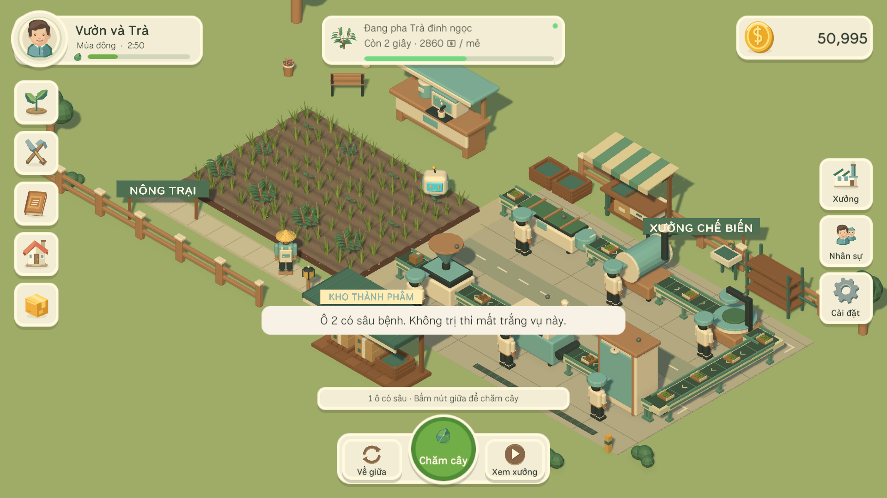
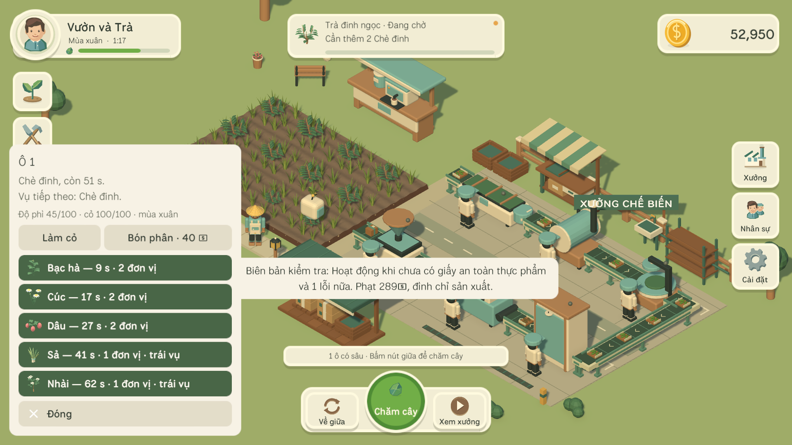
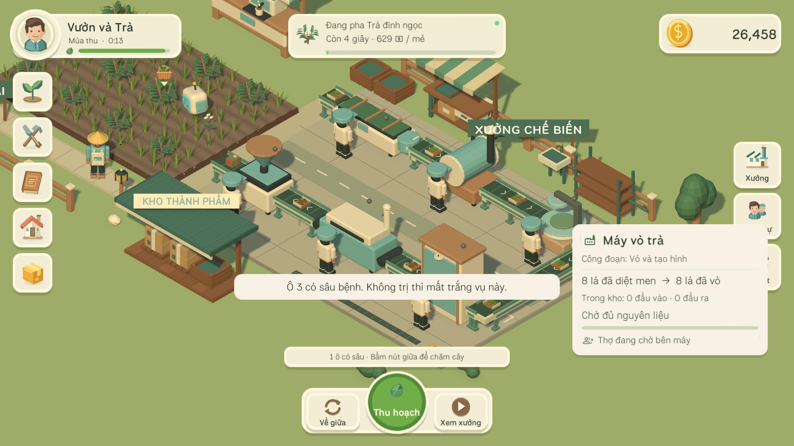
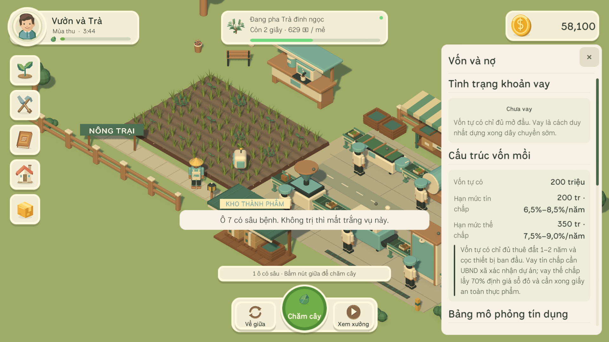
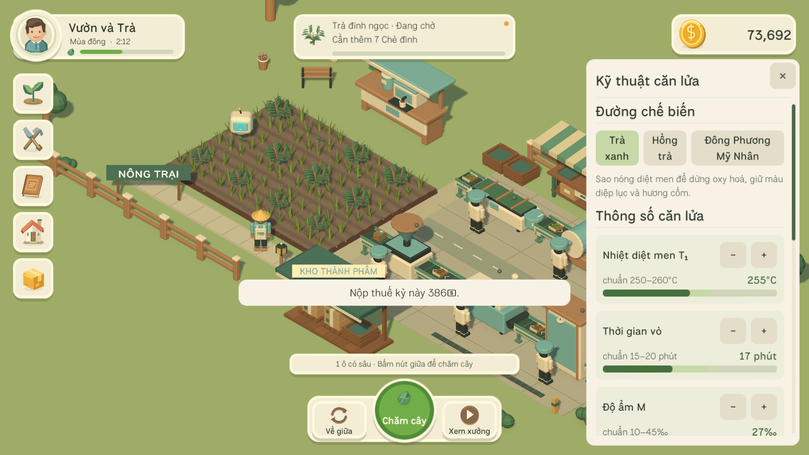
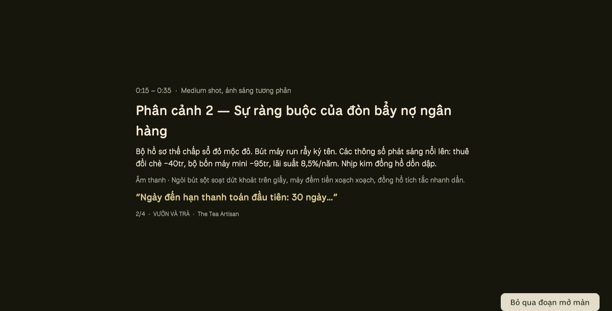
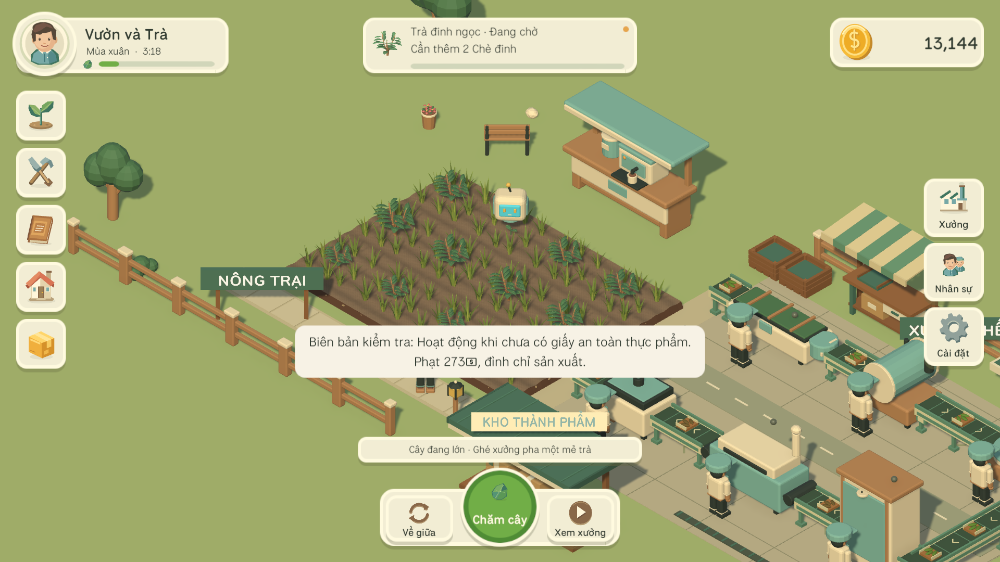

# Vườn và Trà

> Một khu vườn trà nhỏ, một xưởng chế biến, và một món nợ ngân hàng phải trả đúng hạn.

Game mô phỏng nông trại low-poly, làm bằng Unity. Vòng chơi cốt lõi rất nhẹ nhàng — **chọn cây →
gieo → cây lớn → thu → chế biến → bán trà → mở rộng** — nhưng bên dưới nó là một mô hình khởi
nghiệp trà thủ công thật: vay vốn, thời vụ, kỹ thuật căn lửa, giấy phép an toàn thực phẩm, và ba
hướng kinh doanh đánh đổi nhau.



---

## Chơi cái gì

### Trồng và thu hoạch

Mười hai ô đất, chín loại cây gieo được. Mỗi ô có **độ phì, cỏ dại và sâu bệnh** riêng, và cả ba
đều được **chốt ngay lúc gieo** — bón phân giữa vụ không cứu được vụ đang chạy, nên phải lo cho
mảnh đất *trước* khi gieo. Mùa vụ quyết định cây nào trồng được và thu về bao nhiêu.



### Dây chuyền chế biến

Sáu công đoạn nối liền nhau giữa thu hoạch và quầy trà: làm héo → diệt men → vò → lên men → sấy →
đóng gói. Mỗi công đoạn là một cái máy phải mua, và mỗi máy cần một người thợ ăn lương. Thiếu thợ
thì máy cuối dây chuyền nằm không — đó là ý nghĩa của "thiếu người".



### Vốn và nợ

Vốn tự có chỉ đủ mở đầu. Vay tín chấp 200 triệu hay thế chấp 350 triệu, lãi 6,5–9%/năm tuỳ thời
hạn, trả nợ mỗi kỳ. **Ba kỳ liền không trả đủ thì ngân hàng niêm phong nương chè**: xưởng, quầy trà
và robot dừng cho tới khi trả hết. Vẫn hái và bán lá tươi được — đó là đường về, và là đường chậm
nhất.



### Kỹ thuật căn lửa

Bốn thông số trên ba đường chế biến. Khoảng chuẩn **hẹp** còn khoảng chấp nhận được **rộng**: không
đọc sổ tay vẫn làm ra trà bán được, chỉ là không bao giờ đạt giá cao nhất. Vệt sáng trên mỗi thanh
là khoảng chuẩn.



| Đường | Nhiệt T₁ | Vò | Độ ẩm | Oxy hoá |
|---|---|---|---|---|
| Trà xanh | 250–260°C | 15–20 phút | ≤ 45‰ | 0–5% |
| Hồng trà | 100–130°C | 25–40 phút | ≤ 45‰ | 85–95% |
| Đông Phương Mỹ Nhân | 110–140°C | 18–28 phút | ≤ 45‰ | 60–75% |

### Rầy xanh và Đông Phương Mỹ Nhân

Cuối xuân đầu hè, rầy xanh chích hút nhẹ vào nương chè. Cây giải phóng linalool và geraniol để gọi
thiên địch, và chính hai chất đó làm nên **Đông Phương Mỹ Nhân** — giá gấp bốn đến sáu lần. Ô bị
chích hút thu về "lá rầy xanh" chứ không phải búp chè thường, và vụ đó không bị sâu bệnh.

Nhưng phải chế biến đúng đường mới giữ được giá. Sao theo đường trà xanh, hay ủ quá 75%, thì hai
chất đó không chuyển hoá và mẻ ấy chỉ còn một phần năm giá trị.

### Đoạn mở màn

Bốn phân cảnh, một phút năm giây, bỏ qua được.



---

## Bốn tiêu chuẩn thu hái

Chè vào game thành bốn loại cây riêng trên cùng một gốc:

| Phân hạng | Búp một ô | Giá gói 8 búp |
|---|---|---|
| 1 tôm 3 lá (búp xô) | 64 | 120 xu |
| 1 tôm 2 lá (móc câu) | 28 | 300 xu |
| 1 tôm 1 lá (nõn tôm) | 11 | 800 xu |
| 1 tôm (đinh trà) | 4 | 2.200 xu |



Nhân lại thì **doanh thu một vụ của bốn phân hạng gần bằng nhau**. Cái khác là **số lượng**: búp xô
cho gấp mười lăm lần số hàng phải chạy qua dây chuyền để kiếm cùng số tiền. Dây chuyền đang là giới
hạn thì hái non hơn là thắng; dây chuyền còn rộng thì hái xô lại nhanh hơn.

## Ba hướng kinh doanh

Ba nhánh không loại trừ nhau — kết hợp lại mới tối ưu được dòng tiền và giảm rủi ro mùa vụ.

| Nhánh | Biên | Vòng quay vốn | Đánh đổi |
|---|---|---|---|
| Gia công thô B2B | 10–15% | 3–7 ngày | Giá thấp, nhưng **bán được trà mộc** nên khỏi mua máy đóng gói |
| Bán lẻ thủ công | 50–70% | 30–60 ngày | Giá cao nhất, nhưng **tiền về sau 45 ngày** — kỳ này vẫn có thể không đủ trả nợ |
| Du lịch trải nghiệm | 70–85% | ngay | CAPEX cao nhất, thu theo cảnh quan, và **có thu cả mùa đông** |

---

## Chạy game

Cần Unity **6000.6.0f1**. Bản build nằm ở `VuonNho/Build/`:

```bash
VuonNho\Build\VuonNho-dev\VuonNho.exe
```

Hai bản: `VuonNho-playtest` chơi đúng nhịp thật, `VuonNho-dev` có thêm công cụ tua thời gian trong
Cài đặt (1 phút / 60 phút) — cần nó để thấy các mốc dài như kỳ trả nợ hay thời gian thẩm định giấy
phép.

Build lại từ mã nguồn:

```bash
"C:\Program Files\Unity\Hub\Editor\6000.6.0f1\Editor\Unity.exe" -batchmode -quit -projectPath VuonNho -executeMethod VuonNho.EditorTools.BuildTool.BuildWindowsDev -logFile build.log
```

Chơi bằng chuột, từ 1366 × 768 trở lên. Kéo chuột trái để di chuyển góc nhìn, lăn chuột để phóng
to, chuột phải để nhân vật đi tới.

## Kiến trúc

Mô phỏng tách hẳn khỏi hiển thị:

| Assembly | Nội dung | Phụ thuộc |
|---|---|---|
| `VuonNho.Core` | Toàn bộ luật chơi, save, cân bằng | **C# thuần, không tham chiếu UnityEngine** |
| `VuonNho.Infrastructure` | Đọc ghi file, đồng hồ hệ thống | Core + UnityEngine |
| `VuonNho.Views` | Scene, HUD, chuyển động giao diện | Core + Infrastructure |
| `VuonNho.Editor` | Dựng scene, build, chụp ảnh | Editor-only |

Mọi luật trong Core là **hàm thuần trên số nguyên** — cùng đầu vào cho cùng đầu ra, không đồng hồ
thật, không `Random`. Nhờ vậy chạy bù offline cho đúng kết quả của chạy online, và bảng mô phỏng
người chơi xem trong HUD là cùng một phép tính với số tiền thật bị trừ khi đến hạn.

Toàn bộ HUD dựng bằng code, không có prefab UI nào trong scene. Art là model Blender tự sinh, icon
HUD là mesh vector vẽ trong `FarmHudIcon.cs` — không cần file ảnh nào.

## Kiểm thử

```bash
"C:\Program Files\Unity\Hub\Editor\6000.6.0f1\Editor\Unity.exe" -batchmode -projectPath VuonNho -runTests -testPlatform EditMode -testResults results.xml -logFile test.log
```

**207 test EditMode** phủ tính nhất quán thời gian, biên timer, bù offline, save và schema, cân
bằng, sáu mục của mô hình khởi nghiệp trà, và hai mục art: luống đất kề nhau phải khớp mép, và mọi
cây gieo được phải có model chi tiết đã import.

Phần giao diện chạy bằng bộ QA nằm trong chính bản build — **190 mục kiểm** ở cả 1366 × 768 và
1920 × 1080: chơi từ vườn mới tới mở 12 ô, nạp lại save giữa chu kỳ, quét chữ tràn và click xuyên
UI trên mọi bảng, đo frame time và thời gian bù 4 giờ.

```bash
VuonNho\Build\VuonNho-dev\VuonNho.exe -screen-fullscreen 0 -screen-width 1366 -screen-height 768 -vuonnho-qa "Docs\QA-1366x768.md"
```

## Đọc thêm

- [VuonNho/README.md](VuonNho/README.md) — tài liệu kỹ thuật đầy đủ
- [VuonNho/Docs/Mo-phong-khoi-nghiep-tra.md](VuonNho/Docs/Mo-phong-khoi-nghiep-tra.md) — sáu mục của
  bản mô phỏng đã thành cơ chế gì, và những chỗ cố ý làm khác tài liệu
- [VuonNho/Docs/Art/floating-farm-hud.md](VuonNho/Docs/Art/floating-farm-hud.md) — bố cục HUD, lớp
  token và lớp chuyển động
- [Ke-hoach-MVP-Vuon-Nho.md](Ke-hoach-MVP-Vuon-Nho.md) — kế hoạch MVP ban đầu
