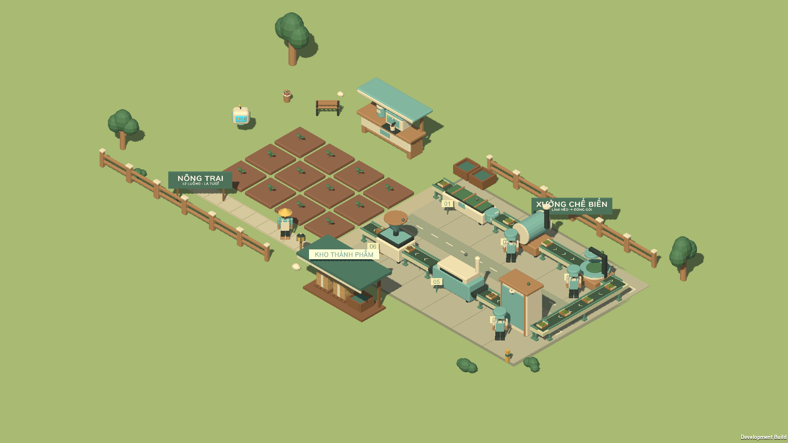

# Map nông trại và xưởng chế biến

Map Garden đã chuyển sang hai khu: 12 luống cây và quầy trà ở phía trái; sân xưởng riêng ở phía phải. Góc nhìn ban đầu thấy được cả hai khu. Các nút **Toàn cảnh / Nông trại / Dây chuyền** ở góc dưới trái đưa camera đến từng khu; vẫn có thể kéo và zoom bằng chuột.

Sáu máy xếp theo tuyến chữ U, đánh số theo thứ tự: **01 Làm héo → 02 Diệt men → 03 Vò → 04 Lên men → 05 Sấy → 06 Đóng gói**. Băng tải đi quanh cạnh ngoài ở chỗ quay đầu, chừa lối đứng máy và đường đi giữa sân. Hai đầu tuyến có khu nhận lá và kho thành phẩm. Nền sân, vạch phân khu, biển tên, pallet, mái kho và hàng rào giúp đọc rõ chức năng của từng khu.

Băng tải xuất hiện khi hai máy nối với nó đã được mua. Khay lá và kiện trà chuyển động theo trạng thái chạy của máy nguồn; đây là hiệu ứng hiển thị, không thêm hoặc trừ kho. Máy chưa mua không tạo collider vô hình. Bấm máy đang có sẽ mở bảng Xưởng.

## Tệp chính

- `Assets/Scenes/Garden.unity`: scene đã dựng và lưu.
- `Assets/Scripts/Core/ProductionLayout.cs`: vị trí tuyến và vùng dành cho xưởng; dùng chung với luật đặt trang trí.
- `Assets/Editor/SceneFactory.cs`: dựng scene bằng các prefab trong GardenSkin.
- `Assets/Editor/FarmFactoryScenery.cs`: sân, đường đi, biển tên, kho và props.
- `Assets/Editor/ProductionLineArt.cs`: băng tải, khay nguyên liệu và biển số công đoạn.
- `Assets/Scripts/Views/ProductionConveyorView.cs`: phản ánh trạng thái máy, chuyển động hàng trên băng tải.
- `Assets/Settings/GardenSkin.asset`: camera toàn cảnh 8.5, nền cỏ 54 m. Prefab máy và cây giữ nguyên hợp đồng cũ.

Vị trí và ID ô đất, quầy trà và robot giữ nguyên. Save không đổi schema. Đồ trang trí đã lưu vẫn được giữ; đồ đặt từ trước trong khu xưởng mới không tự di chuyển. Các lần đặt mới được chặn nếu lấn vào sân xưởng.

## Kiểm tra

- **122/122 EditMode tests đạt**: gồm kiểm tra scene khớp layout Core, sáu máy nằm trong khung hình và vùng đi bộ, collider theo quyền sở hữu, raycast đến cả 12 ô đất, đủ các đoạn băng tải, vùng cấm trang trí và đọc save cũ.
- **111/111 kiểm tra trong player đạt**, ở 1366 × 768: chuỗi sản xuất, mua máy, thợ, kho, HUD, camera, di chuyển, save/reset. Báo cáo: `Docs/QA-factory-map.md`.
- Ảnh chụp từ bản player: `Docs/screenshots/11-farm-factory-hud.png`, `Docs/screenshots/12-farm-factory-map.png` và góc cận `Docs/screenshots/13-production-line-detail.png`. Ảnh minh họa dùng tiến trình QA đã mở đủ 12 ô và 6 máy; không thay đổi tiến trình của người chơi.
- Bản kiểm tra dùng tên sản phẩm riêng `VuonNho-HudReview`. Bản chơi Windows thông thường: `Build/VuonNho-playtest/VuonNho.exe`.

